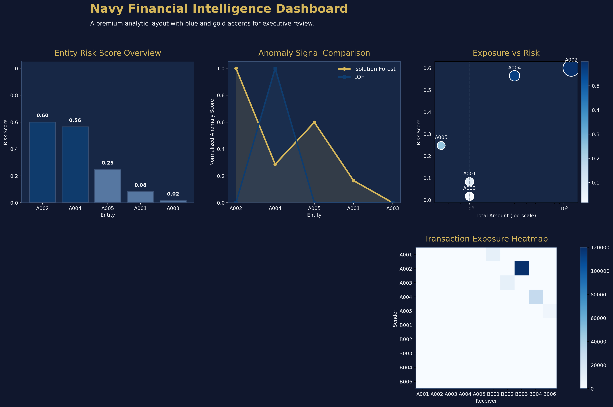
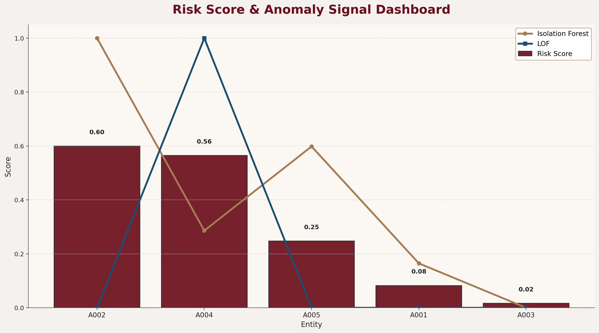

# Financial-Crime-Intelligence-System

A comprehensive financial crime detection platform combining machine learning analytics for anomaly detection 
and risk scoring with a RESTful backend API for data access and visualization. The system processes transaction 
data to identify suspicious patterns, calculate entity risk scores, and provide actionable intelligence for financial 
institutions.

---

## Scope of Analysis

- Transaction data preprocessing and feature engineering 
- Graph-based transaction network visualization  
- Anomaly detection using Isolation Forest and Local Outlier Factor  
- Risk scoring aggregation per entity with weighted calculations
- Automated pipeline execution and CSV export
- REST API endpoints for risk score retrieval
- Database integration with H2 for local development

---

## Sample Results
  

---

## Technologies Used

- Python Analytics: pandas, numpy, scikit-learn, networkx, matplotlib, seaborn
- Machine Learning: IsolationForest, LocalOutlierFactor for anomaly detection
- Java Backend: Spring Boot 3.3.5, Java 17, JPA/Hibernate
- Database: H2 in-memory database for development
- Build Tools: Maven, Python venv  
- API Documentation: OpenAPI/Swagger

---

## Output Files

- `risk_scores.csv` - Aggregated risk scores per entity
- `transactions_scored.csv` - Transaction data with anomaly scores
- `data.sql` - Database seed data

---

## Quick Start

Analytics Pipeline

cd analytics
python -m venv venv
venv\Scripts\activate
pip install -r requirements.txt
python src/main.py

Backend API

cd backend/fcid-backend
.\mvnw spring-boot:run

Access API at: http://localhost:8080/api/risk-scores
H2 Console at: http://localhost:8080/h2-console

## API Endpoints
GET /api/risk-scores — Retrieve all risk scores
GET /api/risk-scores/top — Get top 10 highest risk entities
GET /h2-console — Database administration interface
